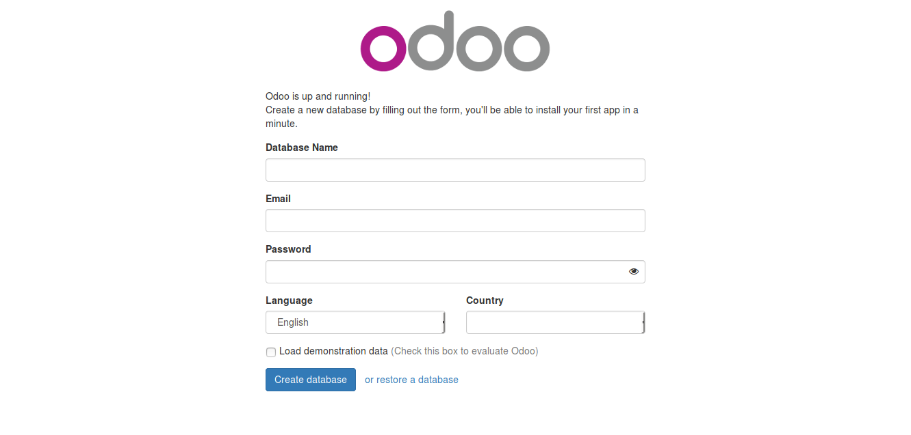

A Debian based OS e,g Ubuntu system is recommended for the Odoo server, though Odoo can run on a variety of operating systems, so why pick Debian at the expense of other operating systems? Because Debian is considered the reference deployment platform by the Odoo team; it has the best support.  It will be easier to find help and additional resources if we work with Debian/Ubuntu. It's also the platform that the majority of developers work on and where most deployments are rolled out.

#####To install Odoo we only need these following applications:
1. Python
2. PostgreSQL
3. Odoo and all the required libraries
However, this could prove to be very challenging at first, so it is adviceable to make use of a virtual machine running Debian or Ubuntu Server(Ubuntu preferably).

#### Creating a user account for Odoo
Our first task is to create an Odoo user on our newly installed __OS__ , many people considered it bad practice to work as super user . In particular, the Odoo server will refuse to run if you start it as the __super user__ .

```bash
    >>> apt-get update && apt-get upgrade # Install system updates
    # This is meant for elivationg the user access right.
    >>> apt-get install sudo # Make sure 'sudo' is installed, 
```
The next step is to create a new user __odoo__ user
```bash
    >>> useradd -m -g sudo -s /bin/bash odoo # Create an 'odoo' user with sudo power
    >>> passwd odoo # Ask and set a password for the new user
```
We can any username/name we want. The __-m__ flag/option/argument ensures that the user's home directory is created. The __-g__ flag/option/argument adds the user to the sudoers list so it can run commands as __super user__ . The -s bin/bash  option sets the default shell to *bash*. Now we should be able to login and using the new user's credentials and set up Odoo.
 
#### Installing Odoo from the source
It is more convenient for module developers as the Odoo source is more easily accessible than using packaged installation. It also makes starting and stopping Odoo more flexible and explicit than the services set up by the packaged installations, and allows overriding settings using command-line parameters without needing to edit a configuration file.

As developers, we will prefer installing them directly from the GitHub repository. This will give us more control over versions and updates. 
To make thing clean and organized, let us create a folder called __odoo10__ in our home directory and change into the directory.
```bash
    >>> sudo apt-get update && sudo apt-get upgrade #Install system updates
    >>> sudo apt-get install git # Install Git
    >>> sudo apt-get install npm # Install NodeJs and its package manager
    >>> curl -sL https://deb.nodesource.com/setup_9.x | sudo -E bash -
    >>> sudo apt-get install -y nodejs
    >>> sudo npm install -g less less-plugin-clean-css #Install less compiler
```
Once we are through installing all the above packages, the next task is to get Odoo from the source __Github__ and install all its dependencies.
```bash
    >>> pwd # This is to confirm that we are in the right directory(Odoo10).
    >>> cd ~/odoo10 # Go into our working directory if not already in Odoo10 directory
    >>> git clone https://github.com/odoo/odoo.git -b 10.0 --depth=1 # Get Odoo source code from github
```
The git  __-b 10.0__ tells Git to explicitly download the 10.0 branch of Odoo. The __--depth=1__ option tells Git to download only the last revision, instead of the full change history, making the download smaller and faster. To start an Odoo server instance, just run:
```bash
    >>> ls # list all the files and directory current directory
    >>> # change to the Odoo source directory
    >>> # Download all the Odoo required system packages
    >>> sudo apt-get install python-pip python-dev build-essential
    >>> sudo pip install --upgrade pip 
```
Next, download system libraries needed for Odoo to run
```
    >>> sudo apt-get install python-dateutil python-docutils python-feedparser python-jinja2 python-ldap python-libxslt1 python-lxml python-mako python-mock python-openid python-psycopg2 python-psutil python-pychart python-pydot python-pyparsing python-reportlab python-simplejson python-tz python-unittest2 python-vatnumber python-vobject python-webdav python-werkzeug python-xlwt python-yaml python-zsi poppler-utils python-pip  python-passlib python-decorator gcc python-dev mc bzr python-setuptools python-markupsafe python-reportlab-accel python-zsi python-yaml python-argparse python-openssl python-egenix-mxdatetime python-usb python-serial lptools make python-pydot python-psutil python-paramiko poppler-utils python-pdftools antiword python-requests python-xlsxwriter python-suds python-psycogreen python-ofxparse python-gevent
```
Now, let us install missing dependencies using python pakage management, in our odoo source diretory run this command, it will install python interface to all the above system pakages.
```python
    sudo pip install -r requirements.txt
```
Odoo is now ready but not finally ready, from our directory run this command: 
By default, Odoo instances listen on port __8069__ , so if we point a browser to
__our-server-ip:8069__ , we will reach the instance. When we access it for
the first time, it shows us an assistant to create a new database, as shown in the following
screenshot:
```bash
    ./odoo-bin #This will launch/start odoo server
```


But wait, we are yet to complete the installation, but we are almost through, we need to set up our database sever(postgresSQL) before we can make use ofour Odoo. let us install the database server quikly.

```bash
    >>> touch /etc/apt/sources.list.d/pgdg.list # use sudo if you don't have access right to create the file
    >>> deb http://apt.postgresql.org/pub/repos/apt/ xenial-pgdg main
    >>> wget --quiet -O - https://www.postgresql.org/media/keys/ACCC4CF8.asc | sudo apt-key add -
    >>> sudo apt-get update 
    >>> sudo apt-get install postgresql-9.6
```
 The repository contains many different packages including third party addons. The most common and important packages are (substitute the version number as required):

* postgresql-client-9.6 - client libraries and client binaries
* postgresql-9.6 - core database server
* postgresql-contrib-9.6 - additional supplied modules libpq-dev - libraries and headers for C language frontend development
* postgresql-server-dev-9.6 - libraries and headers for C language backend development
* pgadmin3 - pgAdmin III graphical administration utility


For us to be able to create a new database, our user must be a PostgreSQL user. The following command creates a PostgreSQL superuser for the current Unix user, though it bad practice to use superadmin for this purpose, but for leaning sake we shall.
```bash
    >>> sudo createuser --superuser $(whoami) # Create postgres user using current log in user.
```
To change the database login for our newly created role/user
```SQL
    ALTER ROLE user_name WITH PASSWORD '****';
```
To create a new database, use the __createdb__ command. Let's create a __demo__ database:
```bash
    >>> createdb demo
```
To initialize this database with the Odoo data schema, we should run Odoo on the empty database using the __-d__ option:
```bash
    >>> ~/odoo-dev/odoo/odoo-bin -d demo
```
This will take a couple of minutes to initialize a __demo__ database, and it will end with an INFO log message, __Modules loaded.__

## D - Building Odoo Module
Just as with building a physical structure, building Odoo modules takes a gradual process. We use a steady, composed approach in building a module. Odoo follows an MVC-- Model-View-Controller --architecture, and we will go through the following layers during the module implementation:

* The model, defining the structure of the data.
* The view, describing the user interface
* The controller, supporting the business logic of the application.

The ***model layer*** is defined with Python objects that have their data stored in the PostgreSQL database. The database mapping is automatically managed by Odoo, and the mechanism responsible for this is the object relational model, (ORM).

The ***view layer*** describes the user interface. Views are defined using XML, which is used by the web client framework to generate data-aware HTML views. 

The web client views perform data persistent actions by interacting with the server ORM. These can be basic operations such as write or delete, but can also invoke methods defined in the ORM Python objects, performing more complex business logic. This is what we refer to as the ***controller layer***.

**Note**: that the concept of controller mentioned here is different from the Odoo web development controllers. Those are program endpoints that web pages can call to perform actions.

With this approach, you will be able to gradually learn about the basic building blocks that make up an application and experience the iterative process of building an Odoo module from scratch.

A typical Odoo module consists of four major files which are: 
1. \__init__.py: which makes our code python importable.
2. \__manifest__.py: which describes our module. It bears the description of our modules and in most cases people see the descriptions to our modules by considering the manifest file.
3. main.py: the main python file which describes the structure of our application as well as contain the business logic our code is set to perform.
4. view.xml: this part of the module is the view which presents an interface for us to load data into the database.

### Steps to building Odoo Module 
In order, to gradually build our module from top to bottom, we need to (1) have installed odoo and a superuser that can create databases, and (2) create a database where we can check the progress of our development.

#### Creating a database
To create a new database we use the command createdb.
Let's create a training_db
database:
``` shell
    $ createdb training_db
```

To initialize this database with the Odoo data schema we should run Odoo on the empty database by using the -d option:
```shell
    $ ~/odoo-dev/odoo/odoo.py -d training_db
```
#### Creating Module
We can either create the module using Odoo's scaffold helper or we create the module manually.

#### Using Scaffold
```shell
./odoo.py scaffold todo_app /[directory]
```
#### Creating each file manually
For a deeper understanding, we will focus on this second method for our development.

* Step 1 - create a folder and give named. 
The convention is to use all lowercase letters and words are joined with underscore(\_). We create a module named todo_app.

* Step 2 - Add two files inside the module. 
Inside the folder (module) we just added, let's add two files namely, \__init__.py and \__manifest__.py respetively.
    * The \__init__.py file: leave this file empty for now.
    * Contents of the \__manifest__.py file.  
      
```python
{
    'name' : "Demo Module",
    'description': """This module is created to demonstrate how to develop Odoo modules""",
    'author': "Mattobell",
    'website': "https://www.mattobell.com",
    'depends':['base'],
    'data': [],
    'demo': [],
    'installbale': True,
    'auto_install':False,
}
```
* Step 3 - Add the module to the addons path and start the server. 
Now that we have a new module, even if minimal, we want to make it available in Odoo. For that, we need to make sure the directory the module is in is part of the addons path. And then we need to update the Odoo module list. We will position in our work directory and start the server with the appropriate addons path configuration:

```shell
$ ./odoo.py -d v8dev --addons-path="custom-addons,odoo/addons"
```
Now let's ask Odoo to acknowledge the new module we just added.
For that, in the Modules section of the ***Settings menu***, select the Update ***Modules List option***. This will update the module list adding any modules added since the last update to the list. 

* Step 4 - Install the module. 
Type "todo" in the search and you should see our new module, ready to be installed. Now click on its Install button and you're done!

* Step 5 - Creating an application model

```python
# -*- coding: utf-8 -*-
from odoo import models, fields
class TodoTask(models.Model):
    _name = 'todo.task'
    name = fields.Char('Description', required=True)
    is_done = fields.Boolean('Done?')
    active = fields.Boolean('Active?', default=True)
```
Right now, this file is not yet used by the module. We must tell Odoo to load it with
the module in the \__init__.py file. Let's edit it to add the following line:

```python
    from . import todo_model
```
That's it. For our changes to take effect the module has to be upgraded. Locate the `To-Do application` in the `Local Modules` and click on its Upgrade button. Now we can inspect the newly created model in the Technical menu. Go to `Database Structure | Models` and search for the `todo.task` model on the list. Then click on it to see its definition.

* Step 6 - Adding menu entries 
Now that we have a model to store our data, let's make it available on the  user interface. All we need to do is to add a menu option to open the To-do Task model so that it can be used. This is done using an XML file. Just as in the case of models, some people consider it good practice to keep the view definitions inside a views subdirectory. We will create a new todo_view.xml data file in the module's top directory, and it will declare a menu item and the action performed by it:
```xml
<?xml version="1.0" encoding="utf-8"?>
<openerp>
    <data>
        <!-- Action to open To-do Task list -->
        <act_window id="action_todo_task"
            name="To-do Task"
            res_model="todo.task"
            view_mode="tree,form" 
            />
                
        <!-- Menu item to open To-do Task list -->
        <menuitem id="menu_todo_task"
            name="To-Do Tasks"
            parent="mail.mail_feeds"
            sequence="20"
            action="action_todo_task" 
            />
    </data>
</openerp>
```
Now we need to tell the module to use the new XML data file. That is done in the \__manifest__.py file using the data attribute. It defines the list of files to be loaded by the module. Add this attribute to the descriptor's dictionary:
```python
    'data': ['todo_view.xml'],
```
Now we need to upgrade the module again for these changes to take effect. Go to the Messaging menu and you should see our new menu option available.

* Step 7 - Creating views – form, tree, and search
As we have seen, if no view is defined, Odoo will automatically generate basic views to get you going. But surely you would like to define the module views yourself, so that's what we'll do next. Odoo supports several types of views, but the three main ones are: list (also called tree), form, and search views. We'll add an example of form and tree views to our module. All views are stored in the database, in the ir.ui.view model.<br>
To add a view in a module, we declare a `<record>` element describing the view in an XML file that will be loaded into the database when the module is installed.

    * **Creating a form view**
    Edit the XML we just created to add this `<record>` element just after the `<data>` opening tag at the top:
```xml
<record id="view_form_todo_task" model="ir.ui.view">
    <field name="name">To-do Task Form</field>
    <field name="model">todo.task</field>
    <field name="arch" type="xml">
        <form>
            <header>
                <button name="do_toggle_done" type="object" string="Toggle Done" class="oe_highlight" />
                <button name="do_clear_done" type="object" string="Clear All Done" />
            </header>
            <sheet>
                <group name="group_top">
                    <group name="group_left">
                        <field name="name"/>
                    </group>
                    <group name="group_right">
                        <field name="is_done"/>
                        <field name="active" readonly="1" />
                    </group>
                </group>
            </sheet>
        </form>
    </field>
</record>
```
This will add a record to the model ir.ui.view with the identifier view_form_todo_task. The view is for the model todo.task and named To-do Task Form. The name is just for information, does not have to be unique, but should allow one to easily identify what record it refers to.

Step 7 - Adding List View
```
<record id="view_tree_todo_task" model="ir.ui.view">
    <field name="name">To-do Task Tree</field>
    <field name="model">todo.task</field>
    <field name="arch" type="xml">
    <tree colors="gray:is_done==True">
        <field name="name"/>
        <field name="is_done"/>
    </tree>
    </field>
</record>
```

Step 8 - Adding Business Logic
Now we will add some logic to our buttons. Edit the ***todo_model.py*** Python file to add to the class the methods called by the buttons. We will use the new API introduced in Odoo 8.0. For backward compatibility, by default Odoo expects the old API, and to create methods using the new API we need to use Python decorators on them. First we need to import the new API, so add it to the import statement at the top of the Python file:

```python
from odoo import models, fields, api
```
The Toggle Done button's action will be very simple: just toggle the *Is Done?* flag. For logic on a record, the simplest approach is to use the @api.one decorator. Here self will represent one record. If the action was called for a set of records, the API would handle that and trigger this method for each of the records.

Inside the TodoTask class add:
```python
@api.one
def do_toggle_done(self):
self.is_done = not self.is_done
return True
```
For the ***Clear All Done*** button we want to go a little further. It should look for all active records that are done, and make them inactive. Form buttons are supposed to act only on the selected record, but to keep things simple we will do some cheating, and it will also act on records other than the current one:
```
@api.multi
def do_clear_done(self):
done_recs = self.search([('is_done', '=', True)])
done_recs.write({'active': False})
return True
```

**N.B.** Other concepts that apply when working with custom modules (by custom I mean modules which we create by ourselves) are Search views and Security-- Access Controls Lists (ACL) and Row-Level Access (Record Rules) which we can't handle in a short training.

## E - Modifying and extending modules
Most times what we'd be doing in Odoo will be to extend an already existing module so how do we do that? This can be achieved using the concept of inheritance.

Inheritance can be achieved on all layers of the Odoo MVC architecture. To achieve this with our application, we create a new module called todo_user. 

* Step 1 - Add a module called todo_user
* Step 2 - Create the first two files in the module to make our module installable.

From the terminal do:
```shell
$ touch __init__.py

$ touch __manifest__.py 
```