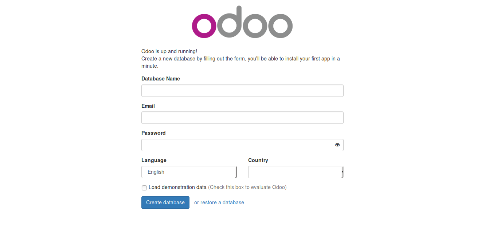

# Installation of Python

## A(1) Installation On Windows operating System
Installation of python on a Windows OS is similar to the installation of any other package. Download the executable file from https://www.python.org/downloads/.

* **Adding to path**
If you open the command prompt and type python, a less-than-friendly error is thrown stating that no package like that can be found. To fix this however, we should add the location to the system path. Click  on  Control  Panel → System →  Advanced → Environment  Variables.  Click  on  the  variable  named  PATH  in  the System  Variables section, then select Edit and add ;C:\Python27 (please verify that this folder exists.

## A(2) Installation on Linux and Mac
On Mac and GNU/Linux distributions, python should come pre-installed. To check if python is installed on Ubuntu, open the terminal (You can type Ctl + Alt + T). Type this command on the terminal which python.

## Summary  
Python is a language with a simple synthax. It is both easy to read and easy to write. Awareness for python is increasing on a daily basis because of the speed of implementation. It's application cuts accross several operations like data analysis, video gaming, web programming, and even machine learning. It\'s open source nature and portability makes it usable on different platforms. 

# B - Python Basics
Python is a simple to write and understand language. Reading Python feels like reading English. In fact Peter Norvig, a well-known Lisp author and Director of Search Quality at Google, iterated that python feels like writing pseudocodes. Because of some of these qualities of python it recently, in a survey done by Stackoverflow overtook languages like Php as the third most preferred language by developers only trailing the likes of javaScript and PhP. In this section of python baics, we will look at some of the qualoities of the language which includes but are not limited to Extensibility, FLOOS etc.

Python is one of those rare languages which can claim to be both simple and powerful. You will find yourself pleasantly surprised to see how easy it is to concentrate on the solution to the problem rather than the syntax and structure of the language you are programming in.

The official introduction to Python is:  
Python  is  an  easy  to  learn,  powerful  programming  language.  It  has efficient  high-level  data  structures  and  a  simple  but  effective  approach to  object-oriented  programming.  Python’s  elegant  syntax  and  dynamic typing,  together  with  its  interpreted  nature, make it an ideal language for scripting and rapid application development in many areas on most platforms.

## B(1) Features of Python
* **Simple**  
Python is a simple and minimalistic language. Reading a good Python program feels almost like reading English, although very strict English! This pseudo-code nature of Python is one of its greatest strengths. It allows you to concentrate on the solution to the problem rather than the language itself.

* **Easy to Learn** <br>
As  you  will  see,  Python  is  extremely  easy  to  get  started  with.  Python  has  an extraordinarily simple syntax, as already mentioned.

* **Free and Open Source**  
Python is an example of a FLOSS (Free/Libré and Open Source Software). In simple terms, you can freely distribute copies of this software, read its source code, make changes to it, and use pieces of it in new free programs. FLOSS is based on the concept of a community which shares knowledge. This is one of the reasons why Python is so good - it has been created and is constantly improved by a community who just want to see a better Python.

* **High-level Language** <br>
When you write programs in Python, you never need to bother about the low-level details such as managing the memory used by your program, etc.

* **Portable** <br>
Due to its open-source nature, Python has been ported to (i.e. changed to make it work on) many platforms. All your Python programs can work on any of these platforms without requiring any changes at all if you are careful enough to avoid any system-dependent features. You can use Python on GNU/Linux, Windows, FreeBSD, Macintosh, Solaris, OS/2, Amiga, AROS, AS/400, BeOS, OS/390, z/OS, Palm OS, QNX, VMS, Psion, Acorn RISC OS, VxWorks, PlayStation, Sharp Zaurus, Windows CE and PocketPC! You can even use a platform like Kivy to create games for your computer and for iPhone, iPad, and Android.

* **Interpreted** <br>
This requires a bit of explanation. A program written in a compiled language like C or C++ is converted from the source language i.e. C or C++ into a language that is spoken by your computer (binary code i.e. 0s and 1s) using a compiler with various flags and options. When you run the program, the linker/loader software copies the program from hard disk to memory and starts running it. Python, on the other hand, does not need compilation to binary. You just run the program directly from the source code. Internally, Python converts the source code into an intermediate form called bytecodes and then translates this into the native language of your computer and then runs it. All this, actually, makes using Python much easier since you don’t have to worry about compiling the program, making sure  that  the  proper  libraries  are  linked  and  loaded, etc. This also makes your Python programs much more portable, since you can just copy your Python program onto another computer and it just works!

* **Object Oriented** <br>
Python supports procedure-oriented programming as well as object-oriented programming. In procedure-oriented languages, the program is built around procedures or functions which are nothing but reusable pieces of programs. In object-oriented languages, the program is built around objects which combine data and functionality. Python has a very powerful but simplistic way of doing OOP, especially when compared to big languages like C++ or Java. 

* **Extensible** <br>
If you need a critical piece of code to run very fast or want to have some piece of algorithm not to be open, you can code that part of your program in C or C\++ and then use it from your Python program.

* **Embeddable** <br>
You can embed Python within your C/C\++ programs to give scripting capabilities for your program’s users.

* **Extensive Libraries** <br>The  Python  Standard  Library  is  huge  indeed.  It  can  help  you  do  various  things involving  regular expressions, documentation generation, unit testing, threading, databases, web browsers, CGI, FTP, email, XML, XML-RPC, HTML, WAV files, cryptography, GUI (graphical user interfaces), and other system-dependent stuff.

## B(2) - First Code -- Hello World!
Enough of all the theories and let's get started with coding. Just like in every other programming course, our aim is to print a message to the console. Open command prompt in Windows or terminal in Mac/Linux and type python (if you get any errors, check the series on how to add python to your system PATH). You should be taken to an environment where you these 3 greater-than symblols (>>>). Type the next command `print("Hello World!")`.

## B(3) - Variables
While building a web app or developing a vidoe game or any other application of sort, we need a way to prompt users for inputs and perform several operations with those input. These input are stored in containers known as variables. Python variables are made of four major types, leaving out the assorted ones list the lists and dictionaries.

* Boolean  
Booleans are list light switches; they have only two states-- on and off --which are True and False.  
Example:
```python
    is_true = True
    is_false = False
    print (type(is_true), type(is_false))
```
The ouput of this code is:  
    `(<type 'bool'>, <type 'bool'>)`

* String
Our names are examples of variables of type string. Strings have values that are quoted with single or double quotation marks. As an example let's declare a variable name with the value of "Olalekan Babawale".

* Integer  
integers are whole numbers without fractional parts. Examples of integers are 1, 2, 4 etc.
Example:
```python
    age = 21
    print(type(age))
```
The code above outputs  
`<type 'int'>`.

* Float  
Floating point numbers are numbers with fractional parts such as 17.90, 8.32, 0.12 etc.  
Example:
```python
    staff_wage = 234.56
    print (type(staff_wage))
```
outputs `<type 'float'>`

* None  
None is a type in Python used to indicate that a variable has no value. This is hardly popular but is still a very important feature of the language. It's can be used to pass a default value as an argument to a function upon which to perform some logic.
Example:  
```python
    name = None
    print(type(name))
```
outputs `<type 'NoneType'>`

## B(4) Adding functionality to our code -- Comments
While the code tells us \'how\', it is the comments that we put in the code that explain why. Commenting is a good attribute of a developer because it expalins to the reader the function of your code even before they are able to absorb the details of the code itself. In practice, this saves the reader (and the reader might even be you).

1. Single-line Comments  
Single-line comments are used to write short notes in the code which do not go beyond a line. Single-line comments are prepended with a (\#) symbol as shown in the code below:

```python
    # I am a single line comment
    print ("Hello world!") # And I am also a single-line comment 
   
```

2. Multi-line comments  
These are used to add comments usually exceeding a line into our code. The comments are enclosed between a pair of three single or double quotation marks on each side.

```python
    '''
    The way python used the multi-line comments is so fascinating
    I cant stop loving it.
    Would you rather come along?
    '''
    def comments():
        """
        Even inside a function block, 
        it works well.
        """
        pass
```

## Summary
Python is indeed an exciting and powerful language. It has the right combination of
performance and features that make writing programs in Python both fun and easy.

# C - Operators and Expressions
## C(1) - Operators
Most statements (logical lines) that you write will contain expressions. A simple example of an expression is 2 + 3. An expression can be broken down into operators and operands.

Operators are functionality that do something and can be represented by symbols such as + or by special keywords. Operators require some data to operate on and such data is called operands. In this case, 2 and 3 are the operands. Python has a wide range of operators but we will consider only a few important ones.
Here is a quick overview of the available operators:  
**\+ (plus)**  
Adds two objects  
3 + 5 gives 8. 'a' + 'b' gives 'ab'.

**\- (minus)**  
Gives the subtraction of one number from the other; if the first operand is absent it is assumed to be zero.  
-5.2 gives a negative number and 50 - 24 gives 26.

**\* (multiply)**  
Gives the multiplication of the two numbers or returns the string repeated that many times.  
2 * 3 gives 6. 'la' * 3 gives 'lalala'.

**\*\* (power)**
Returns x to the power of y
3 ** 4 gives 81 (i.e. 3 * 3 * 3 * 3)

**\/ (divide)**
Divide x by y
13 / 3 gives 4. 13.0 / 3 gives 4.333333333333333

**\% (modulo)**
Returns the remainder of the division
13 % 3 gives 1. -25.5 % 2.25 gives 1.5.

**\< (less than)**
Returns whether x is less than y. All comparison operators return 
True or False.
Note the capitalization of these names.  
5 < 3 gives False and 3 < 5 gives True.  

Comparisons can be chained arbitrarily:  
3 < 5 < 7 gives True.

**\> (greater than)**
Returns whether x is greater than y
5 > 3 returns True. If both operands are numbers, they are first converted to a common type. Otherwise, it always returns False.  

**\<= (less than or equal to)**
Returns whether x is less than or equal to y
x = 3; y = 6; x \# y returns True.

**\>= (greater than or equal to)**
Returns whether x is greater than or equal to y
x = 4; y = 3; x >= 3 returns True.

**\== (equal to)**
Compares if the objects are equal
x = 2; y = 2; x == y returns True.
x = 'str'; y = 'stR'; x == y  returns False.
x = 'str'; y = 'str'; x == y  returns True.

**\!= (not equal to)**
Compares if the objects are not equal
x = 2; y = 3; x != y returns True.

**not (boolean NOT)**
If x is True, it returns False. If x is False, it returns True.
x = True; not x returns False.

**and (boolean AND)**
x and y returns False if x is False, else it returns evaluation of y
x = False; y = True; x and y returns False since x is False. In this case, Python will not evaluate y since it knows that the left hand side of the \'and\' expression is False which implies that the whole expression will be False irrespective of the other values. This is called short-circuit evaluation.

**or (boolean OR)**
If x is True, it returns True, else it returns evaluation of y
x = True; y = False; x or y  returns True. Short-circuit evaluation applies here as well.

**Ternary operator**  
Python also has what we call ternary operator. The ternary operation is an if ... else block except that the expression is written on a line.
For instance we want to assign wear to trousers if sex is male otherwise wear is skirt.

```python
    sex  = "Male"
    wear = "Trousers" if sex == "Male" else "Skirt"
    print(wear)
```
The output of the code is `Trousers`. If we change the sex to Female, the output becomes Skirt.

## C(2) -  Operator Precedence
Python has a built in order of executing python expression. however we won't be treating that in this course. To get the official reference material documenting the order of precedence, [follow this link](http://docs.python.org/3/reference/expressions.html#operator-precedence).

## C(3) - Expressions
We have been using expressions since we started this course. What are expressions? Let's say we have a need to find the area of a rectangle with length 2cm and breadth 4cm. We can go on to perform an operation on the operands using a multiplication (\*) operator and thus assigning the output to a variable called area. This is an expression.  
```python
    length = 2  
    breadth = 3  
    area = length * breadth # this is an expression  
```
We will use expressions throughout our use interaction with python.  

# D - Control Flow
* **If statement**  
We often want to perform an action only after we have checked for a condition, \'If\' statements come in handy in such situations. The basic synthax of the if statement is  
```python
    if <condition>:
        <action_to_perform>
```
Example:  
```python
    name = "Olalekan"
    if name == "Olalekan":
        print ("He's definitely a man!")
```

* **If/Else Statements**
In the last example, we perform an action if our search condition is met, otherwise nothing happens. We oftem want to perform a different action if our test condition is not met. And that is where our If/Else statements play a vital role. The basic structure is:  
```python
    if <condition>:
        <perform_action>
    else:
        <perform_another_action>
```

An example if to a code that prints out if a child is eligible for university based on if s/he is up to 18 years old.

```python
    # This code checks if child is eligible for university
    age = 17
    if age < 18:
        print("You're not eligible for university!")
    else:
        print("Congrats, you can enroll in the university")
```
And this code outputs `You're not eligible for university!`
 
* **If/Elif/Else Statements**  
The If/Elif/Else blocks allow us to check several conditions and perform specific actions based on any of them. We will get the idea better with the use of an example.
```python
    years_of_service = 23
    if years_of_service < 10:
        print("Young employee")
    elif years_of_service < 20:
        print("Intermediate employee")
    else:
        print("Old employee")
```
The code outputs `Old employee`

* **While expression**  
Example:  
```python
    number = 20
    while number > 0:
        print "{num} is greater than 0".format(num=number)
        number -= 1
```
the output of this is:  
```
20 is greater than zero
19 is greater than zero
18 is greater than zero
17 is greater than zero
16 is greater than zero
15 is greater than zero
14 is greater than zero
13 is greater than zero
12 is greater than zero
11 is greater than zero
10 is greater than zero
9 is greater than zero
8 is greater than zero
7 is greater than zero
6 is greater than zero
5 is greater than zero
4 is greater than zero
3 is greater than zero
2 is greater than zero
1 is greater than zero
```
* **For Loop**  
The for loop statement is used to perform iteration over a range of values. The loop repeats till the a termination point is reached. For our example we'll consider the for loop with a range method.
create a python file called for.py and add the following block of code to it.

```python
    for i in range(1, 5):
        print("{}".format(i))
```

The code produces an output of  
```
1
2
3
4
```
Now let's expalain this a little bit. The range() method takes two arguments: the lower bound and the upper bound and generates a list of contiguous values. In our example, the range statement produces a list equivalent to this [1, 2, 3, 4]. So the for statement iterates over the list and prints out each of the items in it.

**Continue statement**
The continue statement is used to skip a loop action for a particular criterium. Let's reconsider our last for loop example. Let\'s skip printing the number three(3). The code looks like this:
```python
    for i in range(1, 5):
    if i == 3:
        continue
    print("{}".format(i))
```
3 is skipped in the output.
```
1
2
4
```  
**Break statement**
The break statement is used to exit a loop prematurely. If in our loop example we want to break out of the loop once we find the number 2, we can introduce a break statement in our code. We tweak the code a little to ensure we print 2 as the last number.
```python
    for i in range(1, 5):
        print("{}".format(i))
    if i == 2:
        break
```

and the output of this is:
```
1
2
```

## E(1) Functions (Procedures)
 
Functions are reusable pieces of programs. They allows us  to give a name and encapsulate a block of statements*(codes)*,  allowing us to run that block using the specified name anywhere in the program and any number of times. 

The function concept is probably the most important building block of any non-trivial software (in any programming language).

Functions are defined using the __def__ keyword. After this keyword comes an identifier
name for the function, followed by a pair of __parentheses__ which may enclose some names of variables, and by the __final colon__ that ends the line. 
Next follows the block of statements that are part of this function. 

Example:
```python
    def employee():
        """Return profile of an an employee"""
        pass # But this does nothing now.
```
From the block of codes, we define a function called __employee__ using the syntax as explained above. This function takes no *parameters (some people called this arguments, but the real name is parameter)* and hence there are no variables declared in the parentheses.

Parameter is an input variable to functions or procedure definition, that gets an actual value(argument) at execution time. 

They are just input to the function so that we can pass in different values to it and get back corresponding results. Notice that we can call the same function twice which means we do not have to write the same code again.

## E(2) Function Parameters
A function can take zero or as many parametes as needed, which value(s) would be supplied to the function at run time(during execution), the function can then do  something using those values. 

These parameters are just like regular variables except that thier values were defined when we call the function and are already assigned values when the function runs.

Parameters are specified within the pair of parentheses in the function definition, separated by commas. When we call the function, we supply the values in the same way. 

__Note the terminology used - the name of variables given in the function definition are called parameters whereas the values you supply in the function call are called arguments.__

Example:

```python
    # definition of a function maximum.py
    def maximum(a, b):
        """Return the greater number between a and b"""
        if a > b:
            print a, 'is greater than', b
        elif a == b:
            print a, 'and b are equal'
        else:
            print b, 'is greater than', a
            
            
    # Now let us call the our maximum function, by passing value to it directly.
    
    maximum(6, 4) # -> 6 'is greater than', 4
    
    # we can also pass variable as an arguments, which is what we will do almost everytime.
    x = 15
    y = 17
    arguments(x, y) # -> 17, 'is greater than', 15
```
From the above code block, we define a function called maximum that accept  two posotional arguments , i.e parameter a and b . 
We then  find out the greater number using a simple __if..else__ statement and then print the bigger number.

## E(3) Local Variables
When ever  we declared any variable inside a function definition, such variable has no relationship with other variable of the same name declared  outside the function block, i.e. variable names are local to the function. 

This is called the __scope of the variable__. All variables have the
scope of the block they are declared in, starting from the point of definition of the name.

```python
    # employee.py
    
    name = 'babatope ajepe'
    
    def employee(name):
        """Return profile of an an employee"""
        print 'name is', name
        name = 'john doe'
        print 'name is now change to', name
        
        # output
        employee(name) # -> name is babatope ajepe
                       # -> name is now changed to john doe
         print name    # -> babatope ajepe 

```
The first time that we print the value of the name __name__ with the first line in the function’s body/block, Python uses the value of the parameter declared in the main block, above the function definition.

Next, we assign the value 'john doe' to __name__ . The variable name __name__ is local to our function. 
So, when we change the value of __name__ in the function, the __name__ defined in the main block remains unaffected.

The last print statement display the value of __name__ as defined in the main block(global scope), confirming that it is actually unaffected by the local assignment within the previously called function.

## E(4) The global statement

If we want to re-assign or change the value to a __name__ declared at the top level of the program, with our __employee__ function. We need to tell Python that the variable is not local, but it is __global__. 

We can do this using the __global statement__. Practically, It is impossible to re-assign a value to a variable defined outside a function without the use global statement. Using the global statement makes it amply clear that the variable is defined in an outermost block.

Example: 
```python 
 # employee.py

    name = 'babatope ajepe'

    def employee(name):
        """Return profile of an an employee"""
        global name  # referencing the global name outside the employee scope.
        print 'name is', name
        name = 'john doe'
        print 'name is now change to', name

        # output
        employee(name) # -> name is babatope ajepe
                       # -> name is now changed to john doe
         print name    # -> john doe
```

The use of the __global__ statement, tells Python that the variable __name__  is a global variable i.e (outside the local scope) hence, when we re-assign a value to __name__ inside the employee function*(local scope)*, that change the value of __name__ in the global scope.

## E(5) Default Argument Values

For some functions, we may want to make some parameters optional and use default values in case the user does not want to provide values for them. 
This is done with the help of default argument values. we can set default argument values for parameters by appending to the parameter name in the function definition the assignment operator __( = )__ followed by the default value.
__Note that the default argument value should be a constant. More precisely, the default argument value should be immutable.__ 

```python 
    def warning(message, times=1):
        """warn a friend about danger ahead, in number of times."""
        print message * times
        
    warning("Don't play with python, it's very dangerous")    # -> Don't play with python, it's very dangerous
    
    warning("Don't play with python, it's very dangerous", 2) # -> Don't play with python, it's very dangerous  
                                                            # -> Don't play with python, it's very dangerous 
```
The function named __warning__ is used to print a string as many times as specified.  If we don’t supply a value, then by default, the string is printed just once. We achieve this by specifying a default argument value of 1 to the parameter times.

In the first usage of __warning__ , we supply only the string and it prints the string once. In the second usage, we supply both the string and an argument __2__ stating that we want to say the string message two  times.
## E(6) Non keyword and key-worded arguments (\*args and \**kwargs)
Key worded arguments are \**kwargs are mostly used in function definitions in Odoo. \*args and \**kwargs allow
us  to pass a variable number of arguments to a function. What variable
means here is that we do not know beforehand how many arguments can be passed to our function by the user.
__*args__ is used to send a non-keyworded variable length argument list to the function. 
Example:
```python
    def accumulate(exam_score, *test_scores):
        print "first normal arg:",  exam_score
        for test_score in test_scores:
            print "another arg through *test_scores:", test_score
            
            
accumulate(50, 16, 15)
```
The accumulate function, accept one formal positional arguent and the followed by now-keyword arguments(**arg), this enables us to call the function with an unlimited number of  now-keyword argument.
__\**kwargs__ allows us to pass keyworded variable length of arguments to a function. Let say we want to handle named arguments, we should use \**kwargs in the function. 
Example:
```python 
    def greet_me(**kwargs):
        for key, value in kwargs.items():
            print("{0} = {1}".format(key, value))
            
    greet_me(name="Ajepe babatope") # -> name = Ajepe babatope
```
## E(7) The return statement
The return statement is used to return from a function i.e. break out of the function. We can optionally return a value from the function as well.
```python
    def maximum(a, b):
        """Return the maximum number between a and b."""
        if a > b:
            return a # The execution will break here if a > b
         elif a == b:
             return 'the numbers are equal' # or here if a == b
         else:
             return b # and if b > a it will break here.
         
     print maximum(2, 2) # -> the numbers are equal
```
The __maximum__ function returns the maximum of the parameters, in this case the numbers supplied to the function.
__Note that a return statement without a value is equivalent to return None__ . 
None is a special type in Python that represents nothingness. For example, it is used to indicate that a variable has no value if it has a value of None.
### Summary
We have seen so covered  many aspects of python functions, that woud=ld be needed for Odoo day to day development,  but note that we still haven’t covered all aspects of them.
# F
## Modules
You have seen how we can reuse our code in any program by defining functions once. What if  we wanted to reuse a number of functions in other programs? 
As you might have guessed, the answer is __modules__. There are various methods of writing modules, but the simplest way is to create a __file__ with a __.py__ extension that contains functions and variables.
Another method is to write the modules in the native language in which the Python interpreter itself was written. For example, you can write modules in the C programming language and when compiled, they can be used from your Python code when using the standard Python interpreter.
A module can be imported by another program to make use of its functionality. This is how we can use the Python standard library as well. First, we will see how to use the standard library modules.
```python
    # module.py 
    import sys # This import the module.
    print('The command line arguments are:')
    for i in sys.argv:
        print i
        
    print '\n\nThe PYTHONPATH is', sys.path, '\n'
    
    >> python module.py we are arguments
        # -> The command line arguments are:
        # -> module_using_sys.py
        # -> we
        # -> are
        # -> arguments
    >>  # ['', '/usr/lib/python2.7', '/usr/lib/python2.7/plat-x86_64-linux-gnu', '/usr/lib/python2.7/lib-tk', '/usr/lib/python2.7/lib-old', '/usr/lib/python2.7/lib-dynload', '/home/ajepe/.local/lib/python2.7/site-packages', '/usr/local/lib/python2.7/dist-packages', '/usr/lib/python2.7/dist-packages', '/usr/lib/python2.7/dist-packages/gtk-2.0']
```
First, we import the __sys module__ using the __import__ statement. Basically, this translates to us telling Python that we want to use this module. 
The sys module contains functionality related to the Python interpreter and its environment i.e. the system. When Python executes the import sys statement, it looks for the __sys__ module. In this case, it is one of the built-in modules, and hence Python knows where to find it.
If it was not a compiled module i.e. a module written in Python, then the Python interpreter will search for it in the directories listed in its __sys.path__ variable. 
If the module is found, then the statements in the body of that module are run and the module is made available for you to use. Note that the initialization is done only the first time that we import a module.
## The from ... import statement
If we want to directly import the __argv__ variable into our program (to avoid typing the __sys.__ everytime for it), then we can use the 
```python 
from sys import argv
```
In general, if possible we should try to avoid using this statement and use the import statement instead, by doing that our program will avoid name clashes and will be more readable.
##Creating our own modules
Creating our own modules is a cinch, we have been doing it all along! This is because every __Python program is also a module__. 
We just have to make sure it has a  __.py__ extension. The following example should make it clear.
```python 
    # my_module.py
    def say_hello():
        print 'Hello to the people of the work'
        
    __version__ = '0.0.1'
```
The code above is a sample module. As we can see, there is nothing particularly special about it compared to our usual Python program.  We will next see how to use this module in our other Python programs.
__Note that the module should be placed either in the same directory as the program from which we import it, or in one of the directories listed in *sys.path.*__
```python
    # another_module.py
    import my_module # importing our first module
    # now, let us call say_hello function in my_module
    
    my_module.say_hello() # - > 'Hello to the people of the work'
    print __my_module.__version__ # ->  0.0.1
    
```
Note that we use the same dotted notation to access members of the module.
```python 
    from my_module import say_hello, __version__
    
    say_hello()  # - > 'Hello to the people of the work'
    print 'Version', __version__   # ->  0.0.1
```
### Summary
Just like functions, modules are reusable programs. Packages are another hierarchy to organize modules. The standard library that comes
with Python is an example of such a set of packages and modules. We have seen how to use these modules and create our own modules.
# H
### Data Structures
In Python, there are four built-in data structures 
* List 
* Tuple 
* Dictionary 
* Set. 
#### List
A list is a data structure that holds a collection of items and it's a mutable data type i.e. this type can be altered.
Example
```python 
    # This is my shopping list
    cart = ['shoe', 'bag', 'powder', 'belt']
    print 'I have', len(cart), 'items to purchase.' # This will return total number of items in the cart.
    print 'These items are:',
    for item in cart:
        print item, # we iterate through the total items to print each item in the cart
        
     # Now let us add more items to the cart
     cart.append('red shoe')
     print cart # ['shoe', 'bag', 'powder', 'belt', 'red shoe']
```
The variable cart is our shopping list, In shoplist , we only store strings of the names of the items to buy but we can add any kind of object to a list including numbers and even other lists. We also used the __for..in__ loop to iterate through the items of the cart.
To know all the methods defined by the list object, see help(list) for more details.
#### Tuple
Tuples are used to hold together multiple objects. Tuple behave in a similar way to lists, but without the all the functionality that the list class gives us. 
One major feature of tuples is that they are __immutable__ like strings i.e. we cannot modify tuples. Tuples are defined by specifying items separated by commas within an optional pair of parentheses.
```python

    zoo = ('python', 'elephant', 'penguin')
    print 'Number of animals in the zoo is', len(zoo)
```
The variable zoo refers to a tuple of items. We see that the len function can be used to get the length of the tuple. This also indicates that a tuple is a sequence as well. *To know all the methods defined by the list object, see help(list) for more details.*
#### Dictionary
A dictionary is like an address-book where you can find the address or contact details of a person by knowing only his/her name i.e. we associate keys (name) with values.
The key must be unique and we can use  only immutable objects (like strings) for the keys of a dictionary but we can use either immutable or mutable objects for the values of the dictionary.
This basically translates to say that you should use only simple objects
```python
    d = {key1 : value1, key2 : value2 } . 
```
Notice that the key-value pairs are separated by a colon and the pairs are separated themselves by commas and all this is enclosed in a pair of curly braces.
Remember that key-value pairs in a dictionary are not ordered in any manner __(in python version < 3.7)__. 
```python
    bio_data = {
        'name' : 'John doe',
        'Age' : 18,
        'sex' : 'Male'.
        'Status' : 'single
    }
    
    # let us print out the bio data information
    for key, value in bio_data.items():
        print '{}  {}'.format(key, value)
    # we can add more information
    bio_data['email'] = 'johndoe@gmail.com'
    # if we print the bio_data now, we should have
    print bio_data #   -> {'name' : 'John doe', 'Age' : 18, 'sex' : 'Male'. 'status' : 'single',  'email : 'johndoe@gmail.com'}
```
#### Set
Sets are unordered collections of simple objects. These are used when the existence of an object in a collection is more important than the order or how many times it occurs. Using sets, you can test for membership, whether it is a subset of another set, find the intersection between two sets, and so on.
```python
    country_in_africa = set(['Nigeria', 'Ghana', 'Togo', 'Liberia])
    'Nigeria' in country_in_africa # -> True
    'Gemany' in country_in_africa # -> False
```
The example is pretty much self-explanatory because it involves basic set theory mathematics taught in school, we can add, remove and also find the union, intersert of the set.
# G
## G Object Oriented Programming
All through till now, we designed our program around functions. This is called the __procedure-oriented way of programming__. There is another better way of organizing our program/code which is to combine data and functionality and wrap it inside something called an __object__. This is called the object oriented programming paradigm. 
Most of the time we can use procedural programming, but when writing large or complex programs we can use object oriented programming techniques.
__Classes__ and __objects__ are the two main aspects of object oriented programming. 
__A class creates a new type where objects are instances of the class.__ 
An analogy is that we can have variables of type int which translates to saying that variables that store integers are variables which are instances (objects) of the int class.
Objects can store data using ordinary variables that belong to the object. Variables that belong to an object or class are referred to as __fields__ or __property__. Objects can also have functionality by using functions that belong to a class. Such functions are called __methods__ of the class. This terminology is important because it helps us to differentiate between
functions and variables which are independent and those which belong to a class or object. 
Collectively, the fields and methods can be referred to as the attributes of that class.
A class is created using the __class__ keyword. The __fields and methods__ of the class are listed in an indented block. 
Class methods have only one specific difference from ordinary functions - they must have an extra first name that has to be added to the beginning of the parameter list, but you do not give a value for this parameter when you call the method, Python will provide it. This particular variable refers to the object itself, and by convention, it is given the name __self__.
#### Classes:
```python
    # class definition
    class Person(object):
        """Don't forget your docstring always."""
        pass # An empty block
        
    p = Person()
    
    print(p) # - >>>  <__main__.person object at 0x7f89445a2f50>

```
We create a new __Person__ class using the __class__ statement, this is followed by an indented block of statements which form the body of
the class. In this case, we have an empty block which is indicated using the pass statement.
Then, we instantiate the object using the name of the class followed
by a pair of parentheses.
We can verify, the type of the variable by simply printing it. It tells us that we have an instance of the __Person class__ in the main module.
#### Methods
We have already discussed that classes/objects can have methods just like functions except that we have an extra self variable. 
Example
```python
    class Person:
        """docstring."""
        
        def talk(self):
            print('Hi, I can talk.')
            
        def walk(self):
            print('See, I can also walk.')
            
            
       # instance of the lass Person
       p = Person()
       p.walk() # -> Hi, I can talk.
       p.talk() # -> See, I can also walk


```
Here we see the __self__ keyword in action. Notice that the __walk__ and __talk__  method takes no arguments, but still has the self in the function definition.
#### The dunder init (\__init__ ) method
There are many method names which have special significance in Python classes. We will see how the init method is useful now.
The \__init__  method is run as soon as an object of a class is instantiated. The method is useful to do any initialization you want to do with your object. 
Notice the double underscores both at the beginning and at the end of the name.
Example
```python
    class Person:
        """docstring."""
        
        def __init__(self, name):
            self.name = name
        
        def talk(self):
            print('Hi {}, can talk.'.fortmat(self.name))
            
        def walk(self):
            print('See, {} can also walk.'.format(self.name))
            
            
       # to instatiate class Person now requires the person's name
       p = Person('Ajepe')
       p.walk() -> # Hi Ajepe, I can walk.
       p.talk() # -> See, Ajepe can also talk
```
Here, we define the init method as taking a parameter name (along with the usual self ). Then, we created a new field/property called name,  notice also that we do not explicitly call the init method but pass the arguments in the parentheses following the class name when creating a new instance of the class.
Now, we are able to use the self.name field or property in our methods.
#### Inheritance
One of the major benefits of object oriented programming is reuseability of code and one of the ways this is achieved is through the inheritance mechanism. Inheritance can be best imagined as implementing a parent and child  relationship between classes.
Suppose you want to write a program which has to keep track of the teachers and students in a college. They have some common characteristics such as name, age and address. They also have specific characteristics such as salary, courses and leaves for teachers and, marks and fees for students.
We can create two independent classes for each type and process them but adding a new common characteristic would mean adding to both of these independent classes.
A better way would be to create a common class called __Member__ and then have the __teacher__ and __student__ classes inherit from this class(__Member__)  i.e. they will become sub-types or child of __Member__ class, and then we can add specific characteristics to these sub-types(child classes). There are many advantages to this approach.
```python
    class Member:
        """Represents any school member."""
        
        def __init__(self, name, age):
            self.name = name
            self.age = age
            print '(Initialized SchoolMember: {})'.format(self.name)
            
        def tell(self):
            """Tell my details."""
            print 'Name:"{}" Age:"{}"'.format(self.name, self.age),
            
            
    class Teacher(Member):
        """Represents a teacher."""
        
        def __init__(self, name, age, salary):
            Member.__init__(self, name, age)
             #super(Member, self)__init__(self, name, age) This is the standard way of doing it.
            self.salary = salary
            print '(Initialized Teacher: {})'.format(self.name)
            
        def tell(self):
        Member.tell(self)
        print 'Salary: "{:d}"'.format(self.salary)
        
    class Student(Member):
         """Represents a student."""
        
        
        def __init__(self, name, age, marks):
            Member.__init__(self, name, age)
            #super(Student, self)__init__(self, name, age) This is the standard way of doing it.
            self.marks = marks
            print '(Initialized Student: {})'.format(self.name)
            
       def tell(self):
           Member.tell(self)
           print 'Marks: "{:d}"'.format(self.marks)
           
           
      #  -> teacher = Teacher('John Doe', 50, 30000)
      #  -> s = Student('Jane JIn', 25, 75)
```
We can use inheritance in python by specifying the base class names in a tuple following the class name in the class definition. Next, we observe that the init method of the base class is explicitly called using the self variable so that we can initialize the base class part of the object. This is very important to remember - Python does not
automatically call the constructor of the base class,we have to explicitly call it ourself.
__Note__ that we can treat instances of Teacher or Student as just instances of the __Member__ when we use the tell method of the __Member__ class.
#### Summary
We have now explored the various aspects of classes and objects as well as the various terminologies associated with it. We have also seen the benefits of object-oriented programming. Python is highly object oriented and understanding these concepts carefully will help us a lot. files in Python.
A Debian based OS e,g Ubuntu system is recommended for the Odoo server, though Odoo can run on a variety of operating systems, so why pick Debian at the expense of other operating systems? Because Debian is considered the reference deployment platform by the Odoo team; it has the best support.  It will be easier to find help and additional resources if we work with Debian/Ubuntu. It's also the platform that the majority of developers work on and where most deployments are rolled out.
#### To install Odoo we only need these following applications:
1. Python
2. PostgreSQL
3. Odoo and all the required libraries
However, this could prove to be very challenging at first, so it is adviceable to make use of a virtual machine running Debian or Ubuntu Server(Ubuntu preferably).

#### Creating a user account for Odoo
Our first task is to create an Odoo user on our newly installed __OS__ , many people considered it bad practice to work as super user . In particular, the Odoo server will refuse to run if you start it as the __super user__ .

```bash
    >>> apt-get update && apt-get upgrade # Install system updates
    # This is meant for elivationg the user access right.
    >>> apt-get install sudo # Make sure 'sudo' is installed, 
```
The next step is to create a new user __odoo__ user
```bash
    >>> useradd -m -g sudo -s /bin/bash odoo # Create an 'odoo' user with sudo power
    >>> passwd odoo # Ask and set a password for the new user
```
We can any username/name we want. The __-m__ flag/option/argument ensures that the user's home directory is created. The __-g__ flag/option/argument adds the user to the sudoers list so it can run commands as __super user__ . The -s bin/bash  option sets the default shell to *bash*. Now we should be able to login and using the new user's credentials and set up Odoo.
 
#### Installing Odoo from the source
It is more convenient for module developers as the Odoo source is more easily accessible than using packaged installation. It also makes starting and stopping Odoo more flexible and explicit than the services set up by the packaged installations, and allows overriding settings using command-line parameters without needing to edit a configuration file.

As developers, we will prefer installing them directly from the GitHub repository. This will give us more control over versions and updates. 
To make thing clean and organized, let us create a folder called __odoo10__ in our home directory and change into the directory.
```bash
    >>> sudo apt-get update && sudo apt-get upgrade #Install system updates
    >>> sudo apt-get install git # Install Git
    >>> sudo apt-get install npm # Install NodeJs and its package manager
    >>> curl -sL https://deb.nodesource.com/setup_9.x | sudo -E bash -
    >>> sudo apt-get install -y nodejs
    >>> sudo npm install -g less less-plugin-clean-css #Install less compiler
```
Once we are through installing all the above packages, the next task is to get Odoo from the source __Github__ and install all its dependencies.
```bash
    >>> pwd # This is to confirm that we are in the right directory(Odoo10).
    >>> cd ~/odoo10 # Go into our working directory if not already in Odoo10 directory
    >>> git clone https://github.com/odoo/odoo.git -b 10.0 --depth=1 # Get Odoo source code from github
```
The git  __-b 10.0__ tells Git to explicitly download the 10.0 branch of Odoo. The __--depth=1__ option tells Git to download only the last revision, instead of the full change history, making the download smaller and faster. To start an Odoo server instance, just run:
```bash
    >>> ls # list all the files and directory current directory
    >>> # change to the Odoo source directory
    >>> # Download all the Odoo required system packages
    >>> sudo apt-get install python-pip python-dev build-essential
    >>> sudo pip install --upgrade pip 
```
Next, download system libraries needed for Odoo to run
```
    >>> sudo apt-get install python-dateutil python-docutils python-feedparser python-jinja2 python-ldap python-libxslt1 python-lxml python-mako python-mock python-openid python-psycopg2 python-psutil python-pychart python-pydot python-pyparsing python-reportlab python-simplejson python-tz python-unittest2 python-vatnumber python-vobject python-webdav python-werkzeug python-xlwt python-yaml python-zsi poppler-utils python-pip  python-passlib python-decorator gcc python-dev mc bzr python-setuptools python-markupsafe python-reportlab-accel python-zsi python-yaml python-argparse python-openssl python-egenix-mxdatetime python-usb python-serial lptools make python-pydot python-psutil python-paramiko poppler-utils python-pdftools antiword python-requests python-xlsxwriter python-suds python-psycogreen python-ofxparse python-gevent
```
Now, let us install missing dependencies using python pakage management, in our odoo source diretory run this command, it will install python interface to all the above system pakages.
```python
    sudo pip install -r requirements.txt
```
Odoo is now ready but not finally ready, from our directory run this command: 
By default, Odoo instances listen on port __8069__ , so if we point a browser to
__our-server-ip:8069__ , we will reach the instance. When we access it for
the first time, it shows us an assistant to create a new database, as shown in the following
screenshot:
```bash
    ./odoo-bin #This will launch/start odoo server
```


But wait, we are yet to complete the installation, but we are almost through, we need to set up our database sever(postgresSQL) before we can make use ofour Odoo. let us install the database server quikly.

```bash
    >>> touch /etc/apt/sources.list.d/pgdg.list # use sudo if you don't have access right to create the file
    >>> deb http://apt.postgresql.org/pub/repos/apt/ xenial-pgdg main
    >>> wget --quiet -O - https://www.postgresql.org/media/keys/ACCC4CF8.asc | sudo apt-key add -
    >>> sudo apt-get update 
    >>> sudo apt-get install postgresql-9.6
```
 The repository contains many different packages including third party addons. The most common and important packages are (substitute the version number as required):

* postgresql-client-9.6 - client libraries and client binaries
* postgresql-9.6 - core database server
* postgresql-contrib-9.6 - additional supplied modules libpq-dev - libraries and headers for C language frontend development
* postgresql-server-dev-9.6 - libraries and headers for C language backend development
* pgadmin3 - pgAdmin III graphical administration utility


For us to be able to create a new database, our user must be a PostgreSQL user. The following command creates a PostgreSQL superuser for the current Unix user, though it bad practice to use superadmin for this purpose, but for leaning sake we shall.
```bash
    >>> sudo createuser --superuser $(whoami) # Create postgres user using current log in user.
```
To change the database login for our newly created role/user
```SQL
    ALTER ROLE user_name WITH PASSWORD '****';
```
To create a new database, use the __createdb__ command. Let's create a __demo__ database:
```bash
    >>> createdb demo
```
To initialize this database with the Odoo data schema, we should run Odoo on the empty database using the __-d__ option:
```bash
    >>> ~/odoo-dev/odoo/odoo-bin -d demo
```
This will take a couple of minutes to initialize a __demo__ database, and it will end with an INFO log message, __Modules loaded.__

## D - Building Odoo Module
Just as with building a physical structure, building Odoo modules takes a gradual process. We use a steady, composed approach in building a module. Odoo follows an MVC-- Model-View-Controller --architecture, and we will go through the following layers during the module implementation:

* The model, defining the structure of the data.
* The view, describing the user interface
* The controller, supporting the business logic of the application.

The ***model layer*** is defined with Python objects that have their data stored in the PostgreSQL database. The database mapping is automatically managed by Odoo, and the mechanism responsible for this is the object relational model, (ORM).

The ***view layer*** describes the user interface. Views are defined using XML, which is used by the web client framework to generate data-aware HTML views. 

The web client views perform data persistent actions by interacting with the server ORM. These can be basic operations such as write or delete, but can also invoke methods defined in the ORM Python objects, performing more complex business logic. This is what we refer to as the ***controller layer***.

**Note**: that the concept of controller mentioned here is different from the Odoo web development controllers. Those are program endpoints that web pages can call to perform actions.

With this approach, you will be able to gradually learn about the basic building blocks that make up an application and experience the iterative process of building an Odoo module from scratch.

A typical Odoo module consists of four major files which are: 
1. \__init__.py: which makes our code python importable.
2. \__manifest__.py: which describes our module. It bears the description of our modules and in most cases people see the descriptions to our modules by considering the manifest file.
3. main.py: the main python file which describes the structure of our application as well as contain the business logic our code is set to perform.
4. view.xml: this part of the module is the view which presents an interface for us to load data into the database.

#### Steps to building Odoo Module 
In order, to gradually build our module from top to bottom, we need to (1) have installed odoo and a superuser that can create databases, and (2) create a database where we can check the progress of our development.

#### Creating a database
To create a new database we use the command createdb.
Let's create a training_db
database:
``` shell
    $ createdb training_db
```

To initialize this database with the Odoo data schema we should run Odoo on the empty database by using the -d option:
```shell
    $ ~/odoo-dev/odoo/odoo.py -d training_db
```
#### Creating Module
We can either create the module using Odoo's scaffold helper or we create the module manually.

#### Using Scaffold
```bash
./odoo.py scaffold todo_app /[directory]
```
#### Creating each file manually
For a deeper understanding, we will focus on this second method for our development.

* Step 1 - create a folder and give named. 
The convention is to use all lowercase letters and words are joined with underscore(\_). We create a module named todo_app.

* Step 2 - Add two files inside the module. 
Inside the folder (module) we just added, let's add two files namely, \__init__.py and \__manifest__.py respetively.
    * The \__init__.py file: leave this file empty for now.
    * Contents of the \__manifest__.py file.  
      
```python
    {
        'name' : "Demo Module",
        'description': """This module is created to demonstrate how to develop Odoo modules""",
        'author': "Mattobell",
        'website': "https://www.mattobell.com",
        'depends':['base'],
        'data': [],
        'demo': [],
        'installbale': True,
        'auto_install':False,
    }
```
* Step 3 - Add the module to the addons path and start the server. 
Now that we have a new module, even if minimal, we want to make it available in Odoo. For that, we need to make sure the directory the module is in is part of the addons path. And then we need to update the Odoo module list. We will position in our work directory and start the server with the appropriate addons path configuration:

```bash
$ ./odoo.py -d v8dev --addons-path="custom-addons,odoo/addons"
```
Now let's ask Odoo to acknowledge the new module we just added.
For that, in the Modules section of the ***Settings menu***, select the Update ***Modules List option***. This will update the module list adding any modules added since the last update to the list. 

* Step 4 - Install the module. 
Type "todo" in the search and you should see our new module, ready to be installed. Now click on its Install button and you're done!

* Step 5 - Creating an application model

```python
    # -*- coding: utf-8 -*-
    from odoo import models, fields
    class TodoTask(models.Model):
        _name = 'todo.task'
        name = fields.Char('Description', required=True)
        is_done = fields.Boolean('Done?')
        active = fields.Boolean('Active?', default=True)
```
Right now, this file is not yet used by the module. We must tell Odoo to load it with
the module in the \__init__.py file. Let's edit it to add the following line:

```python
    from . import todo_model
```
That's it. For our changes to take effect the module has to be upgraded. Locate the `To-Do application` in the `Local Modules` and click on its Upgrade button. Now we can inspect the newly created model in the Technical menu. Go to `Database Structure | Models` and search for the `todo.task` model on the list. Then click on it to see its definition.

* Step 6 - Adding menu entries 
Now that we have a model to store our data, let's make it available on the  user interface. All we need to do is to add a menu option to open the To-do Task model so that it can be used. This is done using an XML file. Just as in the case of models, some people consider it good practice to keep the view definitions inside a views subdirectory. We will create a new todo_view.xml data file in the module's top directory, and it will declare a menu item and the action performed by it:
```xml
    <?xml version="1.0" encoding="utf-8"?>
   <odoo>
       <data>
           <!-- Action to open To-do Task list -->
           <act_window id="action_todo_task" name="To-do Task" res_model="todo.task" view_mode="tree,form"/>
                
           <!-- Menu item to open To-do Task list -->
           <menuitem id="menu_todo_task" name="To-Do Tasks" parent="mail.mail_feeds" sequence="20" action="action_todo_task" />
        </data>
    </odoo>
```
Now we need to tell the module to use the new XML data file. That is done in the \__manifest__.py file using the data attribute. It defines the list of files to be loaded by the module. Add this attribute to the descriptor's dictionary:
```python
    'data': ['todo_view.xml'],
```
Now we need to upgrade the module again for these changes to take effect. Go to the Messaging menu and you should see our new menu option available.

* Step 7 - Creating views – form, tree, and search
As we have seen, if no view is defined, Odoo will automatically generate basic views to get you going. But surely you would like to define the module views yourself, so that's what we'll do next. Odoo supports several types of views, but the three main ones are: list (also called tree), form, and search views. We'll add an example of form and tree views to our module. All views are stored in the database, in the ir.ui.view model.<br>
To add a view in a module, we declare a `<record>` element describing the view in an XML file that will be loaded into the database when the module is installed.

    * **Creating a form view**
    Edit the XML we just created to add this `<record>` element just after the `<data>` opening tag at the top:
```xml
    <record id="view_form_todo_task" model="ir.ui.view">
        <field name="name">To-do Task Form</field>
        <field name="model">todo.task</field>
        <field name="arch" type="xml">
            <form>
                <header>
                    <button name="do_toggle_done" type="object" string="Toggle Done" class="oe_highlight" />
                    <button name="do_clear_done" type="object" string="Clear All Done" />
                </header>
                <sheet>
                    <group name="group_top">
                        <group name="group_left">
                            <field name="name"/>
                        </group>
                            <group name="group_right">
                                <field name="is_done"/>
                                <field name="active" readonly="1" />
                        </group>
                    </group>
                </sheet>
            </form>
        </field>
    </record>
```
This will add a record to the model ir.ui.view with the identifier view_form_todo_task. The view is for the model todo.task and named To-do Task Form. The name is just for information, does not have to be unique, but should allow one to easily identify what record it refers to.

Step 7 - Adding List View
```
    <record id="view_tree_todo_task" model="ir.ui.view">
        <field name="name">To-do Task Tree</field>
        <field name="model">todo.task</field>
        <field name="arch" type="xml">
            <tree colors="gray:is_done==True">
                <field name="name"/>
                <field name="is_done"/>
            </tree>
        </field>
    </record>
```

Step 8 - Adding Business Logic
Now we will add some logic to our buttons. Edit the ***todo_model.py*** Python file to add to the class the methods called by the buttons. We will use the new API introduced in Odoo 8.0. For backward compatibility, by default Odoo expects the old API, and to create methods using the new API we need to use Python decorators on them. First we need to import the new API, so add it to the import statement at the top of the Python file:

```python
     from odoo import models, fields, api
```
The Toggle Done button's action will be very simple: just toggle the *Is Done?* flag. For logic on a record, the simplest approach is to use the @api.one decorator. Here self will represent one record. If the action was called for a set of records, the API would handle that and trigger this method for each of the records.

Inside the TodoTask class add:
```python
    @api.one
    def do_toggle_done(self):
        self.is_done = not self.is_done
        return True
```
For the ***Clear All Done*** button we want to go a little further. It should look for all active records that are done, and make them inactive. Form buttons are supposed to act only on the selected record, but to keep things simple we will do some cheating, and it will also act on records other than the current one:
```
    @api.multi
    def do_clear_done(self):
        done_recs = self.search([('is_done', '=', True)])
        done_recs.write({'active': False})
        return True
```

**N.B.** Other concepts that apply when working with custom modules (by custom I mean modules which we create by ourselves) are Search views and Security-- Access Controls Lists (ACL) and Row-Level Access (Record Rules) which we can't handle in a short training.

#### E - Modifying and extending modules
Most times what we'd be doing in Odoo will be to extend an already existing module so how do we do that? This can be achieved using the concept of inheritance.

Inheritance can be achieved on all layers of the Odoo MVC architecture. To achieve this with our application, we create a new module called todo_user. 

* Step 1 - Add a module called todo_user
* Step 2 - Create the first two files in the module to make our module installable.

From the terminal do:
```bash
    $ touch __init__.py

    $ touch __manifest__.py 
```